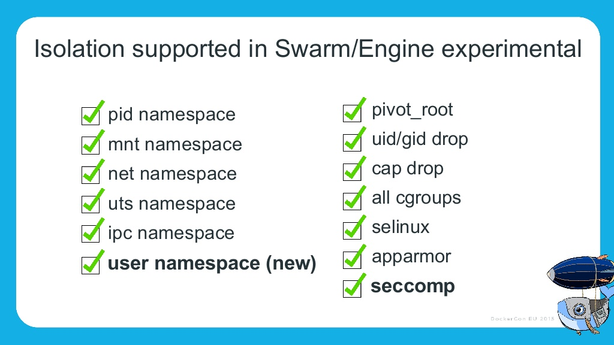
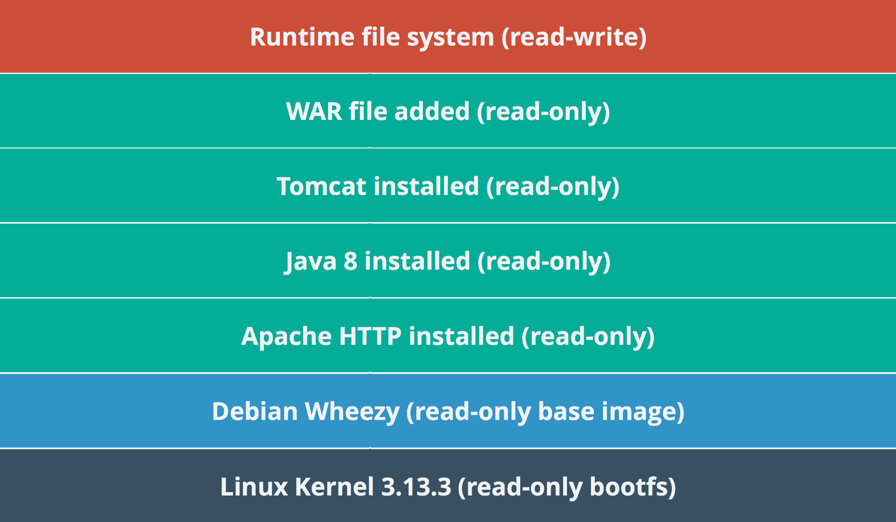
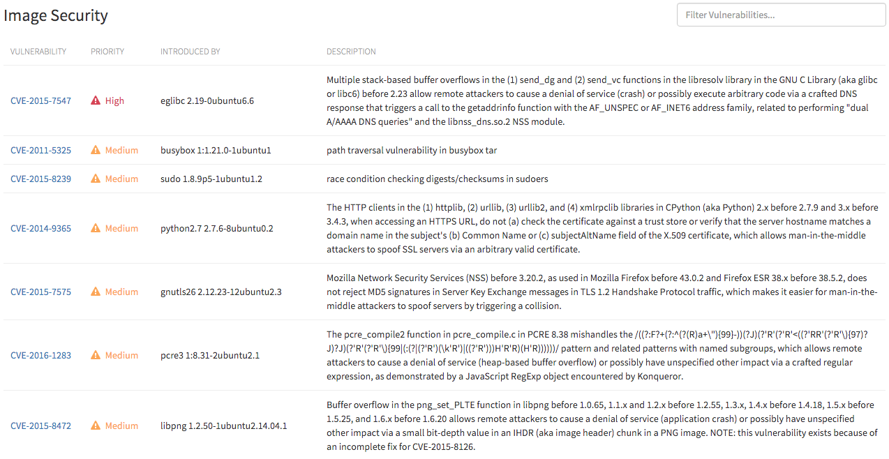
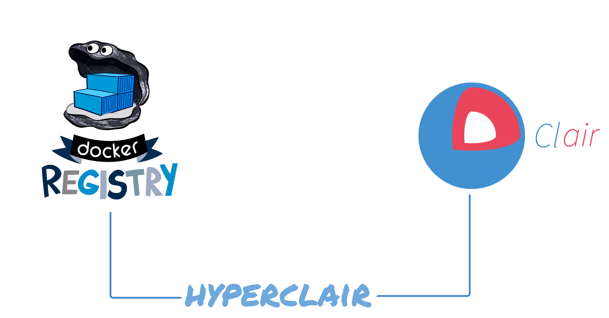

class: middle,center
# Container Vulnerability Analysis
## CoreOS Clair & Clair Control (formerly Hyperclair)

.center[]
---
.logo[]

# Who am I?

- Devops facilitator @ Wemanity
- Docker lover
- Golang dev newbie
- Eternal frustrated

.profile[]

Twitter: [@jgsqware](https://twitter.com/jgsqware)

Github: [github.com/jgsqware](http://www.github.com/jgsqware)

???

---
.logo[]

#Agenda

1. Container Security concern
1. Vulnerabilities
1. Docker Image, Layers & Registry
1. CoreOS Clair
1. Clair Control
1. Demo

---

class: center, middle
.logo[]

##What's one of the main concern when talking about using container in production/sensitive environment?

---

class: middle, center
.logo[]

# SECURITY!

> Container is a security nightmare.

---
class: middle, center
.logo[]

## [Container-Solution's Docker Security Cheat-sheet](http://container-solutions.com/docker-security-cheat-sheet/)
.center[]

---
.logo[]

# Docker security
Since 1.10 .right[.note[&nbsp;]]

.center[]

---
.logo[]

# Docker security
Since 1.10 .right[.note[-> Missing vulnerability analysis]]

.center[]

# Vulnerabilities
class: middle, center

---
.logo[]

# What is a vulnerability?

ISO 27005 defines vulnerability as:

> .quote[A weakness of an asset or group of assets that can be exploited by one or more threats]

> .quote[An asset is anything that has value to the organization, its business operations and their continuity, including information resources that support the organization's mission]

---
.logo[]

# Last big vulnerabilities

- **Heartbleed** [CVE-2014-0160](https://access.redhat.com/security/cve/cve-2014-0160): in OpenSSL cryptography
- **Dual A/AAAA DNS queries** [CVE-2015-7547](https://access.redhat.com/security/cve/cve-2015-7547): GNU C Library (aka glibc or libc6)

---
.logo[]

# CVE - .subtitle[Common Vulnerabilities and Exposure tracker]

.center[[Debian Security Bug Tracker](https://security-tracker.debian.org/tracker)]
.center[[Ubuntu CVE Tracker](https://launchpad.net/ubuntu-cve-tracker)]
.center[[Red Hat Security Data](https://www.redhat.com/security/data/metrics)]
.center[[dpkg](https://en.wikipedia.org/wiki/dpkg)]
.center[[rpm](http://www.rpm.org)]

---
.logo[]

# Vulnerability Analysis

2 ways:

- Dynamic analysis
- Static analysis

---
.logo[]

# Dynamic analysis

- performed by executing programs on a real or virtual processor
- container must be running

---
.logo[]

# Static analysis

- performed without executing programs
- the filesystem of the container image is inspected

---
.logo[]

# Docker Image, Layers & Registry

.center[]

---
.logo[]

# Docker Layers

.center[]

---
class: middle, center
.logo[]

# How do you analyse Docker container?

---
.logo[]

# CoreOS Clair

Clair is an open source project for the static analysis of vulnerabilities in **rkt** and **Docker** containers.

- Enable a more transparent view of the security of container-based infrastructure.
- Vulnerability data is continuously imported
- Notification on new Vulnerability state with images affected
- Works with AppC & Docker images format

On github: [github.com/coreos/clair](http://www.github.com/coreos/clair)

---
.logo[]

# CoreOS Clair
.center[]

---
class: middle, center
.logo[]

# Use Case

---
.logo[]

# Quay.io - online automatic analysis

Quay.io - Private Hosted registry

- CoreOS Family
- Support Clair by default for all images
- Powerful views for reports
- Integrate easily with CI and Git repository

Have nothing to do.
1. Upload your docker image
2. Open security tabs
3. Tadaa...

---
.logo[]

# Quay.io - Vulnerabilities

.center[]
---
.logo[]

# On Premise Registry
- [Dockyard](https://github.com/containerops/dockyard): an open source container registry with Clair integration
- [Registry-UI](https://github.com/jgsqware/registry-ui): Simple UI interface with security reports and User authentication

---
.logo[]

# Continuous integration pipeline security

- New vulnerability is introduced
- Clair notify CI of new vulnerability along with the image affected
- CI stop the automatic deployment & notify development team
- Dev team fix the vulnerability and push the new container
- CI build & test and send to Clair new container
- Clair analyse it and update vulnerability state

---
.logo[]

# Local Image Analysis

- Creating new image
- Depends on third-party container
- Prevent before curing

➜ [local image analysis tool](https://github.com/coreos/clair/tree/master/contrib/analyze-local-images)

---
.logo[]

# How to integrate Clair

- Clair API
- Or...

---
class: middle, center
.logo[]

# Hyperclair

---
.logo[]

# Hyperclair

.center[]
> .quote[Tracking vulnerabilities in your container images, it's easy with **CoreOS Clair**.]

> .quote[Integrate it inside your CI/CD pipeline is easier with **Hyperclair**.]

---
.logo[]

# Hyperclair

- Lightweight CLI (written in go)
- Bridge between Registries (Docker Hub, Docker Registry, Quay.IO) and Clair vulnerability tracker
- Html/ASCII report generation
- Open Source (followed by Clair team)

---
.logo[]

# Hyperclair

- Command based on Docker Client Command
  - `hyperclair version`
  - `hyperclair health`
  - `hyperclair pull jgsqware/ubuntu-git`
  - `hyperclair push jgsqware/ubuntu-git`
  - `hyperclair analyse jgsqware/ubuntu-git`
  - `hyperclair report -f [html|json] jgsqware/ubuntu-git`

---
.logo[]

# Hyperclair

- Current version: `v0.2.0`
  - Support
    - Docker Registry based container (authenticated or not)
    - Docker Hub

- On going
 - Login as Docker Client
 - Support of Quay.io and Google Cloud Container Registry
 - Analysing Local images

---
class: middle,center

# Questions ?
