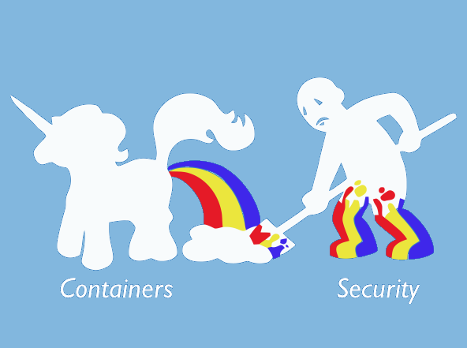
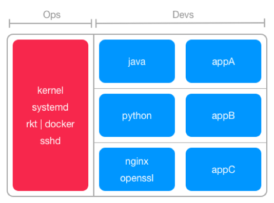
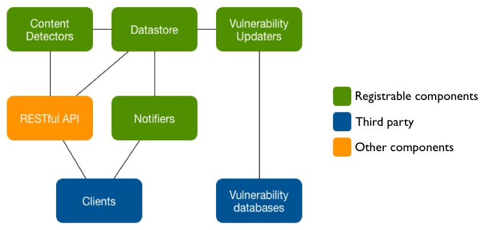

class: middle,center
# Container Vulnerability Analysis
## CoreOS Clair & Hyperclair


</br></br>
.name[Twitter: [@jgsqware](https://twitter.com/jgsqware) &nbsp;&nbsp;&nbsp;&nbsp;&nbsp;&nbsp; Github: [github.com/jgsqware](http://www.github.com/jgsqware)]
</br></br>
.center[]

---
class: center, middle
.logo[]


##Main concern using container 
##in production/sensitive environment?

---
class: center
.logo[]

# SECURITY!

> Container is a security nightmare.



---
class: middle,center

#Context
---
class: middle, center
background-image: url(images/containers.jpg)
background-size: repeat

.logo[]


.center[]

---
class: middle, center
background-color: #64db72
.logo[]


## Containers, containers everywhere
.center[]

---
class: middle, center
background-color: #f75b5b

.logo[]


## Crappy, crappy containers everywhere
.center[]


---
class: middle
.logo[]


.left-cs[]

---
class: middle
.logo[]


.left-cs[]

---
class: middle, center

.logo[]
# Vulnerabilities
> .center.quote[A vulnerability is a weakness who allows an attacker to reduce a system's information assurance.]

---
class: middle, center
background-color: black
.logo[]


# .note[Heartbleed] 

.white[[CVE-2014-0160](https://access.redhat.com/security/cve/cve-2014-0160): The TLS and DTLS implementations in OpenSSL do not properly handle
Heartbeat Extension packets]

---
class: middle,center
background-color: black
.logo[]

# .note[Ghost]   

.white[[CVE-2015-0235](https://access.redhat.com/security/cve/CVE-2015-0235): a buffer overflow bug affecting the gethostbyname() and
gethostbyname2() function calls in the glibc library.]

---
.logo[]

# .center[CVE - .subtitle[Common Vulnerabilities and Exposure tracker]]

</br></br></br></br>
.big.center[[Debian Security Bug Tracker](https://security-tracker.debian.org/tracker)]
.big.center[[Ubuntu CVE Tracker](https://launchpad.net/ubuntu-cve-tracker)]
.big.center[[Red Hat Security Data](https://www.redhat.com/security/data/metrics)]

---
class: middle, center
.logo[]


# Vulnerability Analysis
## Dynamic vs Static

---
.logo[]


# Dynamic analysis
> .center.quote-big[context: there is millions of containers images]

- performed on a **real or virtual** processor
- container must be **running**

-------------------------------------------------------------------------

- running millions of containers is **expensive**
- *untrusted* containers is **Unsafe**
- Dynamic analysis tools need **Human** input

---
.logo[]


# Static analysis
> .center.quote-big[context: there is millions of containers images]
> .center.quote-big[Over 15 vulnerabilites/day]

- performed **without executing programs**
- the **filesystem** of the container image is **inspected**

-----------------------------------------------------------------------------

- Static tools like **dpkg** and **rpm** is used to analyze filesystem
- Containers layers are analyzed **only once**

---
class: middle, center
.logo[]

# How do you analyse containers?

---
class: middle, center
background-color: white
.logo[]


> .quote-big[an open source project for the static analysis of vulnerabilities in **rkt** and **Docker** containers.]
.right.small[[github.com/coreos/clair](http://www.github.com/coreos/clair)]


---
.logo[]

.center[]

</br></br>
- .big[**transparent** security view]
- .big[Vulnerability data is **continuously imported**]
- .big[**Notification** on new Vulnerability state with images affected]
- .big[**AppC** & **Docker** support]

---
.logo[]

.center[]

</br>
.center[]

---
.logo[]

.center[]

</br>
.center[]

---
.logo[]

.center[]

</br>
.center[]

---
.logo[]

.center[]

</br>
.center[]

---
.logo[]

.center[]

</br>
.center[]

---
.logo[]

.center[]

</br>
.center[]

---
.logo[]

.center[]

</br>
.center[]

---
.logo[]

.center[]

</br></br>

- .big[Static analyzis] .side-note[distribution specific]
- .big[Do the job only once] .side-note[backed by Postgresql]
- .big[Suggest & Notify] .side-note[webhook]
- .big[Built as a framework] .side-note[pluggable]

---
class: middle, center
.logo[]

# Can I already used it?
---
.logo[]

# Online automatic analysis with 
####Private Hosted registry

</br>
- **CoreOS** Family
- Support Clair **by default** for all images
- Powerful views for reports
- Integrate easily with CI and Git repository

---
.logo[]


# Online automatic analysis with 

3 steps only

1. Upload your image
2. Open security tabs
---
.logo[]


# Online automatic analysis with 

3 steps only

1. Upload your image
2. Open security tabs
3. Tadaa... 

.img-right[]

---
.logo[]

# Security analysis report on 

.left-cs[]

---
class: middle, center
.logo[]


# Use Cases

---
class: center, middle
.logo[]

# Continuous integration pipeline security 

---
.logo[]


# Continuous integration pipeline security 

.center[]

---
.logo[]


# Continuous integration pipeline security 

.center[]


---
class: center, middle
background-image: url(images/present.jpg)
.logo[]
<br><br><br><br><br><br>

#.white-stroke[Shift-Left mindest]
## .white-stroke[Give the tools to your developers]

---
class: center, middle
.logo[]


# How do I analyze my local images with Clair?


---
class: middle, center
.logo[]


# Hyperclair

---
.logo[]


# Hyperclair

- Lightweight CLI (written in go)
- Bridge between Registries (Docker Hub, Docker Registry) and Clair vulnerability tracker
- Html report generation
---
class: middle, center
.logo[]


# Why?

---
.logo[]


# .center[Why?]
</br></br></br>

- Want to learn **Go**
- Analyze-local-image tool is not **User-Friendly**
- **Registry Authentication** needed
- **Big need** in my current project context


---
.logo[]


# Hyperclair

- Command based on Docker Client Command
  - `hyperclair version`
  - `hyperclair health`
  - `hyperclair pull jgsqware/ubuntu-git`
  - `hyperclair push jgsqware/ubuntu-git`
  - `hyperclair analyse jgsqware/ubuntu-git`
  - `hyperclair report -f [html|json] jgsqware/ubuntu-git`

---
.logo[]


# Hyperclair - Configuration

- Configuration file:
  
  ```
  clair:
      port: 6060
      healthPort: 6061
      uri: http://clair
      priority: Low
      report:
        path: ./reports
        format: html
  ```
  


---
.logo[]


# Hyperclair - Configuration

- Environment variables:

  `HYPERCLAIR_<property>`
  
  eg. `HYPERCLAIR_CLAIR_PORT=6060`

---
.logo[]

# Local Image Analysis with hyperclair

.center[]

---
.logo[]

# .name[What's next:] Clair
    
 - MySQL driver for datastore
 - Alpine, Npm,... trackers
 

---
.logo[]

# .name[What's next:] Hyperclair

- Current version: `v0.5.0`
    - Login through different registries
        - Docker Registry on premise
        - Docker Hub
    - Local image analysis
    
- Future
 - Will be integrated in Clair repository as **Clairctl** ([PR #164](https://github.com/coreos/clair/pull/164))
 - Support of Quay.io and Google Cloud Container Registry
 - Many more...

---
class: middle,center
.logo[]


# Demo

---
class: middle,center
.logo[]


# Questions ?
