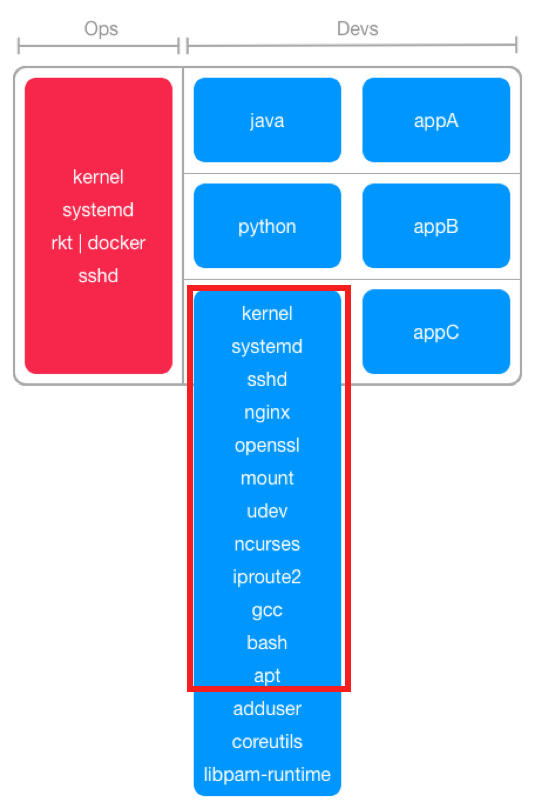

class: middle,center
# Container Vulnerability Analysis
## CoreOS Clair & Clair Control (formerly Hyperclair)

.center[]
---
.logo[]

# Who am I?

- Devops facilitator @ Wemanity
- Docker lover
- Golang dev newbie
- Eternal frustrated

.profile[]

Twitter: [@jgsqware](https://twitter.com/jgsqware)

Github: [github.com/jgsqware](http://www.github.com/jgsqware)

---

class: center, middle
.logo[]

##What's one of the main concern when talking about using container in production/sensitive environment?

---
class: center
background-color: #3482BC
background-image: url(images/DevOps-Security.png)

.logo[]

# SECURITY!

> Container is a security nightmare.

---
class: middle, center
background-image: url(images/containers.jpg)
background-size: repeat

.logo[]

.center[]

---
class: middle, center
.logo[]

## Containers, containers everywhere
.center[]

---
class: middle, center
.logo[]

## Crappy, crappy containers everywhere
.center[]

---
class: middle, center
.logo[]

## [Container-Solution's Docker Security Cheat-sheet](http://container-solutions.com/docker-security-cheat-sheet/)
.center[]

---
class: middle, center

.logo[]
# Vulnerabilities
> .center.quote[A vulnerability is a weakness who allows an attacker to reduce a system's information assurance.]

---
class: middle, center
.logo[]

# Heartbleed  .note[bigger]

[CVE-2014-0160](https://access.redhat.com/security/cve/cve-2014-0160): The TLS and DTLS implementations in OpenSSL do not properly handle
Heartbeat Extension packets

---
class: middle,center
.logo[]

# Ghost   .note[bigger]

[CVE-2015-0235](https://access.redhat.com/security/cve/CVE-2015-0235): a buffer overflow bug affecting the gethostbyname() and
gethostbyname2() function calls in the glibc library.

---
.logo[]

# CVE - .subtitle[Common Vulnerabilities and Exposure tracker] .note[add logo]

.center[[Debian Security Bug Tracker](https://security-tracker.debian.org/tracker)]
.center[[Ubuntu CVE Tracker](https://launchpad.net/ubuntu-cve-tracker)]
.center[[Red Hat Security Data](https://www.redhat.com/security/data/metrics)]

---
.logo[]

# Vulnerability Analysis

2 ways:

- Dynamic analysis
- Static analysis

---
.logo[]

# Dynamic analysis
> .center.quote-big[context: there is millions of containers images]

- performed by executing programs on a real or virtual processor
- container must be running

- running millions of containers is **expensive**
- *untrusted* containers is **Unsafe**
- Dynamic analysis tools need **Human** input

---
.logo[]

# Static analysis
> .center.quote-big[context: there is millions of containers images]
> .center.quote-big[Over 15 vulnerabilites/day]

- performed without executing programs
- the filesystem of the container image is inspected

- Static tools like **dpkg** and **rpm** is used to analyze filesystem
- Containers layers are analyzed **only once**

---
class: middle, center
.logo[]

# How do you analyse containers?

---
.logo[]

.center[]

> .center.quote-big[an open source project for the static analysis of vulnerabilities in **rkt** and **Docker** containers.]
.right.small[[github.com/coreos/clair](http://www.github.com/coreos/clair)]

- Enable a more **transparent view** of the security of container-based infrastructure.
- Vulnerability data is **continuously imported**
- **Notification** on new Vulnerability state with images affected
- Works with **AppC** & **Docker** images format

---
.logo[]

.center[]

> .center.quote-big[an open source project for the static analysis of vulnerabilities in **rkt** and **Docker** containers.]
.right.small[[github.com/coreos/clair](http://www.github.com/coreos/clair)]

- Static analysis
- Do the job only once
- Suggest & Notify
- Built as a framework

---
.logo[]

# CoreOS Clair
.center[]

---
.logo[]

# Currently supported

- Image format: appc, Docker
- Operating systems: Debian, Ubuntu, CentOS
    - Detection: package managers (dpkg, rpm)
    - Vulnerability sources: Distribution-specific
- Database: PostgresSQL 9.4+
- Notification: Webhook

---
class: middle, center
.logo[]

# Can I already used it?
---
.logo[]

# Quay.io - online automatic analysis

Quay.io - Private Hosted registry .note[add logo]

- **CoreOS** Family
- Support Clair **by default** for all images
- Powerful views for reports
- Integrate easily with CI and Git repository

---
.logo[]

# Quay.io - online automatic analysis

3 steps only

1. Upload your docker image
2. Open security tabs
3. Tadaa... 

.center.note[magic pics]

---
.logo[]

# Quay.io - Vulnerabilities .note.small[new report images]

.center[]

---
class: middle, center
.logo[]

# Use Cases

---
class: center, middle
.logo[]

# Continuous integration pipeline security 

---
.logo[]

# Continuous integration pipeline security 

.note[create schema]

- Developers create a new images based on third-party image
- He push it to git and trigger a build on CI
- CI pushed new image version to clair
- New vulnerability is introduced
- Clair notify CI of new vulnerability along with the image affected
- CI stop the automatic deployment & notify development team
- Dev team fix the vulnerability and push the new container
- CI build & test and send to Clair patched version of image
- Clair analyse it and update vulnerability state
- Clair notify CI of no new vulnerability
- CI continue continous deployment

---
class: center, middle
background-image: url(images/present.jpg)
.logo[]
      

#.white[Shift-Left mindest]
## .white[Give the tools to your developers]

---
.logo[]

# Local Image Analysis

.note[create schema]

- Developers create a new images
- Depends on third-party container
- Clair could be local
- Prevent before curing

---
class: center, middle
.logo[]

# How do I analyze my local images with Clair?

---
class: middle, center
.logo[]

# Clair Control aka clairctl .small[formerly known as Hyperclair]

---
.logo[]

# Clair Control aka clairctl

.note[better schema]
.center[]

- Lightweight CLI (written in go)
- Bridge between Registries (Docker Hub, Docker Registry, Quay.IO) and Clair vulnerability tracker
- Html/ASCII report generation

---
.logo[]

# Clair Control aka clairctl

- Command based on Docker Client Command
  - `hyperclair version`
  - `hyperclair health`
  - `hyperclair pull jgsqware/ubuntu-git`
  - `hyperclair push jgsqware/ubuntu-git`
  - `hyperclair analyse jgsqware/ubuntu-git`
  - `hyperclair report -f [html|json] jgsqware/ubuntu-git`

---
.logo[]

# Clair Control aka clairctl

- Current version: `v0.4.0`
  - Support
    - Login through different registries
        - Docker Registry on premise
        - Docker Hub
    - Local image analysis
    
- On going
 - Support of Quay.io and Google Cloud Container Registry

---
class: middle,center

# Demo

---
class: middle,center

# Questions ?
