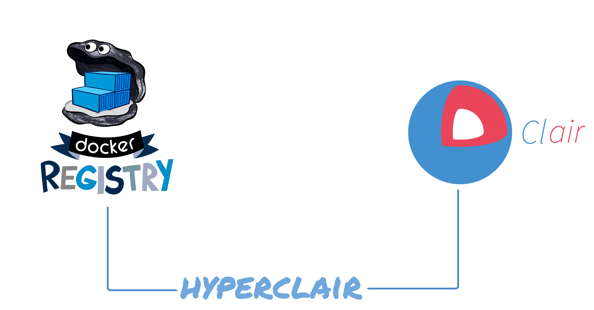

# Hyperclair
---

#Agenda

1. Who am I?
2. Docker Image, Layers & Registry
3. Vulnerabilities
  - Static vs Dynamic Analysis
4. CoreOS Clair
  - Use Case
    - Quay.io
  - On Premise
5. Hyperclair
    - Why?
    - What could you do with hyperclair?
      - Analyse
      - Report
6. Demo

---

# Who am I?

---

# Security

What's the main concern when talking about Docker in production/sensitive environment?

SECURITY!

Container is a security nightmare.

http://container-solutions.com/docker-security-cheat-sheet/

# Docker security concern
Since 1.10

# Docker Image, Layers & Registry

## Docker Images

# Vulnerabilities

## What is a vulnerability?

ISO 27005 defines vulnerability as:

> A weakness of an asset or group of assets that can be exploited by one or more threats

> An asset is anything that has value to the organization, its business operations and their continuity, including information resources that support the organization's mission

## Last big vulnerabilities

- Heartbleed [CVE-2014-0160](https://access.redhat.com/security/cve/cve-2014-0160): in OpenSSL cryptography
- Dual A/AAAA DNS queries [CVE-2015-7547](https://access.redhat.com/security/cve/cve-2015-7547): GNU C Library (aka glibc or libc6)

## CVE - Common Vulnerabilities and Exposure tracker

[Debian Security Bug Tracker]: https://security-tracker.debian.org/tracker
[Ubuntu CVE Tracker]: https://launchpad.net/ubuntu-cve-tracker
[Red Hat Security Data]: https://www.redhat.com/security/data/metrics
[dpkg]: https://en.wikipedia.org/wiki/dpkg
[rpm]: http://www.rpm.org

# Vulnerability Analysis

2 ways:

- Dynamic analysis
- Static analysis

## Dynamic analysis

- performed by executing programs on a real or virtual processor
- container must be running

## Static analysis

- performed without executing programs

# CoreOS Clair

Clair is an open source project for the static analysis of vulnerabilities in [appc] and [docker] containers.

- Enable a more transparent view of the security of container-based infrastructure.
- Vulnerability data is continuously imported
- Notification on new Vulnerability state with images affected
- Works with AppC & Docker images format

On github: [github.com/coreos/clair](http://www.github.com/coreos/clair)

# Use Case

## Quay.io - online automatic analysis

Quay.io - Private Hosted registry

- CoreOS Family
- Support Clair by default for all images
- Powerful views for reports
- Integrate easily with CI and Git repository

Have nothing to do.
1. Upload your docker image
2. Open security tabs
3. Tadaa...
[QUAY IO SECURITY SCREENSHOT]

## On Premise Registry
- [Dockyard](https://github.com/containerops/dockyard): an open source container registry with Clair integration
- [Registry-UI](https://github.com/jgsqware/registry-ui): Simple UI interface with security reports and User authentication

### Continuous integration pipeline security

- New vulnerability is introduced
- Clair notify CI of new vulnerability along with the image affected
- CI stop the automatic deployment & notify development team
- Dev team fix the vulnerability and push the new container
- CI build & test and send to Clair new container
- Clair analyse it and update vulnerability state

## Local Image Analysis

- Creating new image
- Depends on third-party container
- Prevent before curing

[local image analysis tool](https://github.com/coreos/clair/tree/master/contrib/analyze-local-images)

# How to integrate Clair

- Clair API
- Or...

# Hyperclair

> Tracking vulnerabilities in your container images, it's easy with CoreOS Clair.
> Integrate it inside your CI/CD pipeline is easier with Hyperclair.

- Lightweight CLI (written in go)
- Bridge between Registries (Docker Hub, Docker Registry, Quay.IO) and Clair vulnerability tracker
- Html/ASCII report generation
- Open Source (followed by Clair team)

--------

- Command based on Docker Client Command
  - `hyperclair version`
  - `hyperclair health`
  - `hyperclair pull jgsqware/ubuntu-git`
  - `hyperclair push jgsqware/ubuntu-git`
  - `hyperclair analyse jgsqware/ubuntu-git`
  - `hyperclair report -f [html|json] jgsqware/ubuntu-git`

- Current version: `v0.2.0`
  - Support
    - Docker Registry based container (authenticated or not)
    - Docker Hub

- On going
 - Login as Docker Client
 - Support of Quay.io and Google Cloud Container
